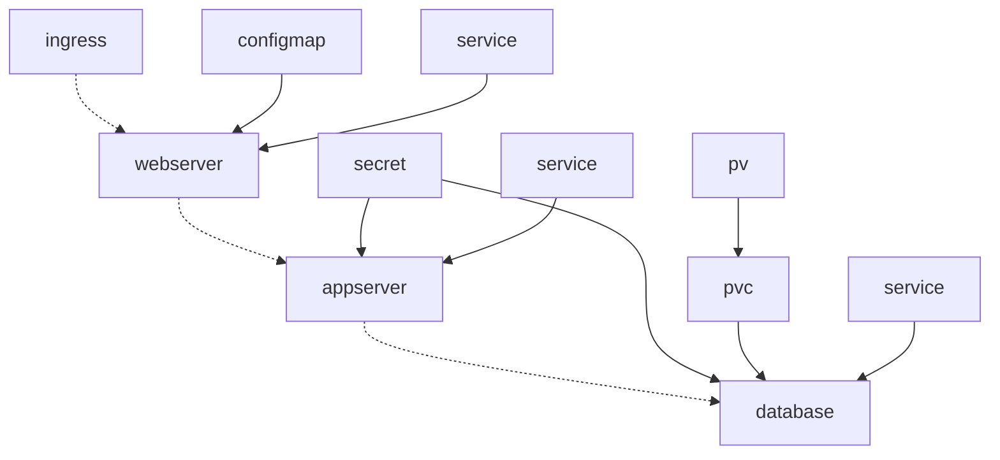

# Exercício Final

Neste exercício vamos provisionar três aplicações:

- Webserver, baseado na imagem **docker.io/library/nginx:alpine**
- Appserver, baseado na imagem **docker.io/hectorvido/csharp:latest**
- Database, baseado na imagem **docker.io/library/mysql:8-debian**

Todos manifestos devem estar dentro de um `Namespace` chamado **unimed**.

A única aplicação exposta publicamente deve ser o Webserver através de um `Ingress`.



## Webserver

O Webserver será um `Deployment` e utilizará um `ConfigMap` para fazer proxy reverso para o Appserver. O `ConfigMap` representa um arquivo de configuração do **nginx** que deve ser montado em `/etc/nginx/conf.d` e precisará fazer referência ao nome do `Service` que aponta para o Appserver na sessão `upstream dotnet`.

> Não será preciso utilizar `subPath`.

**nginx.conf**

```
server {
    listen       80;
    listen  [::]:80;
    server_name  localhost;

    error_page   500 502 503 504  /50x.html;
    location = /50x.html {
        root   /usr/share/nginx/html;
    }

    location / {
        proxy_pass http://dotnet;
        proxy_set_header Host $host;
    }
}

upstream dotnet {
    server <svc>:8080;
}
```

## Database

A Database poderá ser um `Deployment` ou um `StatefulSet`, deverá montar um `PersistentVolumeClaim` e todas as suas variáveis de ambiente deverão ser importadas de um `Secret` através de `envFrom`.

**mysql.env**

```env
MYSQL_ROOT_PASSWORD=Abc123_
MYSQL_USER=unimed
MYSQL_PASSWORD=unimed
MYSQL_DATABASE=unimed
```

## Appserver

O Appserver será um `Deployment` e deverá importar suas variáveis de ambiente através de `secretKeyRef` baseado no `Secret` **mysql.env** convertendo os nomes, por exemplo, `MYSQL_USER` para `DB_USER`.
